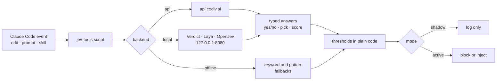

<div align="center">

# jev-tools

**Let a tiny decision model make the cheap, frequent judgments, so Claude doesn't have to.**

A [Claude Code](https://code.claude.com) plugin for the terminal and the desktop app.
Does this edit break a project rule? Which skill fits this prompt? Which file matters? Does this diff need a careful review?

[](https://pypi.org/project/jev-tools-setup/)


[Quick start](#-quick-start) · [Choose a backend](#-choose-how-jev-runs) · [What's inside](#-whats-inside) · [Privacy](#-privacy-what-leaves-your-machine) · [Troubleshooting](#-when-something-looks-wrong) · [Reference](#-reference)

</div>

---

jev-tools asks **OpenJev** ([Codiv](https://codiv.ai) "System One") typed questions (yes/no, pick-one, score) and gets calibrated probabilities back instead of generated text. There is nothing to parse and nothing to hallucinate; your own code applies the thresholds. It runs against the **hosted API**, a **model on your own machine**, or in an **offline** pattern-only mode.

> [!IMPORTANT]
> **Early and shadow-first.** Everything was built and measured against a live Codiv key (numbers in [MEASUREMENTS.md](https://github.com/Rcidshacker/jev-tools/blob/main/docs/MEASUREMENTS.md)), but the samples are small and OpenJev is a young model. The plugin ships in **shadow mode**: hooks only *log* what they would have done. Nothing blocks or injects until you switch to `active`.
> Independent project, not affiliated with Codiv, OpenJev or TypeSafe AI.

Write-up with the numbers, failures and privacy notes: [I built a Claude Code plugin around a model that only answers yes/no](https://dev.to/rcids/i-built-a-claude-code-plugin-around-a-model-that-only-answers-yesno-what-worked-what-failed-1ecj) · feedback welcome in [issue #1](https://github.com/Rcidshacker/jev-tools/issues/1).

## 🚀 Quick start

**You need:** Python 3.10+ as the command `python` (the hooks call exactly that), the [`claude` CLI](https://code.claude.com), and [`uv`](https://docs.astral.sh/uv/) or `pipx`.

```bash
# 1. install the setup tool (once)
uv tool install jev-tools-setup          # or: pipx install jev-tools-setup

# 2. optional, read-only: is this machine ready?
jev-tools-setup check

# 3. install the plugin and choose how Jev runs
jev-tools-setup
```

Setup installs the skills, scripts and hooks through Claude Code (so **terminal and desktop share one install**), asks which backend you want, validates it, and finishes by writing `~/.jev-tools/LOG.md`. **Restart Claude Code**, then run the `status` skill to confirm everything is wired.

> Prefer a one-shot run without installing anything? `uvx jev-tools-setup check` and `uvx jev-tools-setup` work too. To run the latest unreleased code straight from GitHub, use `uvx --from git+https://github.com/Rcidshacker/jev-tools jev-tools-setup`.

<details>
<summary><b>No uv or pipx? Install the plugin by hand</b></summary>

Inside Claude Code:

```text
/plugin marketplace add Rcidshacker/jev-tools
/plugin install jev-tools@jev-tools
```

Then give it a key (or a local server) yourself, see [Reference](#-reference). Try it for one session without installing: `claude --plugin-dir /path/to/jev-tools`.

</details>

## 🔀 Choose how Jev runs

| | **`api`** | **`local`** | **`offline`** |
|---|---|---|---|
| **What it is** | Hosted OpenJev at `api.codiv.ai` | A model on your machine | No model, pattern fallbacks |
| **Best for** | Best accuracy, zero setup beyond a key | Privacy, no key, no quota | Plugin installed but nothing sent anywhere |
| **Needs** | A free [Codiv key](https://codiv.ai/dashboard) (100M input tokens) | Verdict/Laya: any CPU or GPU. Full OpenJev: NVIDIA Blackwell-class GPU + Docker | Nothing |
| **Leaves your machine** | Diffs, prompts, rules (see [Privacy](#-privacy-what-leaves-your-machine)) | Nothing (weights download once from Hugging Face) | Nothing |
| **Model quality** | Full OpenJev (all measurements below) | Verdict and Laya are **small and unmeasured here** | n/a |

<details>
<summary><b>api</b>: paste a key, it is checked and stored safely</summary>

Setup asks for your key in a **hidden prompt**, validates it with one live call, and stores it in `~/.jev-tools/credentials` with owner-only permissions (`chmod 600`, or `icacls` on Windows). A rejected key saves nothing. The key is never passed on a command line and never logged.

</details>

<details>
<summary><b>local</b>: Verdict 151M, Laya 421M, or the full OpenJev model</summary>

Setup asks which model:

| Model | Size | Context | Options | Notes |
|---|---|---|---|---|
| `verdict-1.4` | 151M | 512 tokens | up to 24 | Smallest. Ignores a yes/no question's `criteria`. Runs on CPU or any GPU |
| `laya-1.0` | 421M | 1,024 tokens | about 20 | Heavier. Runs on CPU or any GPU |
| `openjev-latest` | 26B | 65,536 tokens | 255 | Needs an NVIDIA **Blackwell-class** GPU (NVFP4) and Docker ([self-hosting guide](https://codiv.ai/docs/guides/self-hosting)) |

For Verdict/Laya, setup shows the plan and the download size, waits for your **yes**, then clones [OpenJev](https://github.com/razorback16/openjev) into `~/.jev-tools`, creates a venv and installs the model's extra (PyTorch comes with it and can be several GB; weights are about 0.6 GB / 1.7 GB as fp32). Start the server in its own terminal and keep it open:

```bash
jev-tools-setup serve        # add --device cpu to force the CPU
```

**What changes with a small model.** Each question is read with its own copy of the state, cut from the end at the model's window. jev-tools therefore trims long diffs and file excerpts to fit, sends fewer files per `find-files` request, caps option lists (23 for Verdict, 19 for Laya, so `browser-nav` sees fewer elements) and declines a question it cannot shrink. `review-precheck` will mostly say "full review" because its diff is usually cut. **All thresholds and measurements come from the full OpenJev model**, so keep small models in `shadow` and run the `rule-calibrate` skill before switching to `active`.

> [!NOTE]
> The small-model install follows OpenJev's documented steps but is new in 0.3.0 and has not been measured on real projects yet.

</details>

<details>
<summary><b>offline</b>: "offline" means no model, not no internet</summary>

Nothing is sent anywhere. Deterministic fallbacks still run, and each says what it cannot do:

| Piece | Offline behaviour |
|---|---|
| `review-precheck` | Regex checks for secrets, dependency files, auth keywords, schema/migration changes, test weakening and swallowed errors. Says "fast" **only** for a small (30 lines or fewer) clean diff |
| Rule hook | Blocks only a **literal token** that a "never / don't / avoid X" rule forbids (e.g. `console.log`). No judgment |
| Skill hook | Picks by keyword match |
| `find-files` | Ranks by keyword count (in our measurements the model was no better, see below) |
| `browser-nav` | Suggests the element whose name matches the goal, always marked *unsure* |
| `rule-calibrate` | Unavailable: it needs a model, and says so |

These are patterns, not understanding. They miss anything phrased unusually, so keep offline in `shadow`.

</details>

## 🧰 What's inside

| Piece | Kind | What it does |
|---|---|---|
| **Rule hook** `rule_enforcer.py` | `PreToolUse` on `Edit\|Write\|MultiEdit` | Reads your `CLAUDE.md` / `AGENTS.md` rules, asks whether the pending edit breaks one, re-checks any hit with a stricter question, and in `active` mode blocks the write with the rule it broke |
| **Skill hook** `skill_picker.py` | `UserPromptSubmit` (**opt-in**) | Picks the one installed skill that fits your prompt, confirms it, and in `active` mode adds a one-line pointer to the context |
| `find-files` | skill | Keyword candidates, then two-stage scoring, prints the most relevant files. A hint, not an oracle |
| `browser-nav` | skill | Picks each next click from the page's interactive elements; Claude executes and judges pass/fail |
| `review-precheck` | skill | Seven yes/no policy questions on a git diff decide *fast pass* vs *full review* |
| `rule-calibrate` | skill | Replays recent commits against your rules: which are decisive, noisy, weak or quiet, *before* you enforce anything |
| `status` | skill | One screen: backend, key found (by name), mode, hook state, recent events and errors |
| `report` | skill | Writes the plain-English [`LOG.md`](#-when-something-looks-wrong) |

## ⚙️ How it works



Each piece turns a fuzzy judgment into typed questions, sends them with the relevant text as `state` to `POST /v1/systemone`, and applies thresholds in ordinary code. **Every failure path is explicit:** hooks **fail open** (an outage never blocks your edit or prompt) and the review pre-check **fails safe** (an outage routes to full review). Details and the reasoning behind each threshold: [HOW_IT_WORKS.md](https://github.com/Rcidshacker/jev-tools/blob/main/docs/HOW_IT_WORKS.md).

### Modes

| Mode | Rule hook | Skill hook |
|---|---|---|
| `shadow` (default) | logs the verdict, never blocks | logs the pick, injects nothing |
| `active` | blocks an edit flagged at ≥ 0.80 **and** confirmed at ≥ 0.70 | injects `Jev skill pick: <name>` (if enabled) |
| `off` | does nothing, makes no call | does nothing |

**Recommended path:** run in `shadow` for a week, read `LOG.md`, run `rule-calibrate` on a project, then switch that setup to `active`. Set the mode with the plugin's `mode` option or `JEV_MODE` (the variable wins).

## 🔒 Privacy: what leaves your machine

With the **`api`** backend this plugin sends text to a third party (`api.codiv.ai`). **`local` and `offline` send nothing.** Read this before enabling `api` on any project.

| Piece | What is sent (api only) |
|---|---|
| Rule hook (every `Edit`/`Write`) | file name, the unified diff (up to 8,000 characters) and the text of your project rules |
| Skill hook (**opt-in**, every prompt) | your prompt, plus the names and descriptions of your installed skills |
| `find-files` | the query and short excerpts of candidate files |
| `review-precheck` / `rule-calibrate` | the git diff (up to 30k characters) / recent commit hunks |
| `browser-nav` | the goal, the URL and the names of the page's interactive elements |

- **Shadow mode still sends.** The hook needs the model's answer to log it. Only `mode: off` sends nothing.
- **A local seatbelt runs first.** Before sending, these become `[REDACTED]`: private-key blocks, vendor-style keys (`sk-`/`sk_live_`, AWS, Google, GitHub, Slack, npm), JWTs, `Bearer` tokens, credentials in connection strings, assignments to names containing password/secret/token/api key, and long hex or base64-looking strings. Files named like secrets (`.env*`, `*.pem`, `*.key`, `id_rsa*`, `credentials*`, `secrets*` …) are never read into a request. It is a pattern match: a bare token in an unusual shape, **names, emails, customer or employee records and internal business data are not caught**, and about 0.2% of ordinary code lines that mention `token`/`secret` get partly redacted. Risk reduction, not a guarantee.
- **Retention is unknown to us.** Codiv's public API docs say nothing about how request data is stored or used. Check their terms before sending anything you would not paste into a public forum.
- **Nothing sensitive is stored locally.** The decision log holds verdicts, probabilities, latency and token counts, never file contents and never the key.

Turn it off for one project (regulated, customer, employee or client data) in that project's `.claude/settings.local.json`:

```json
{ "env": { "JEV_MODE": "off" } }
```

## 🩺 When something looks wrong

`jev-tools-setup` always ends by writing **`~/.jev-tools/LOG.md`**, even when setup fails. Refresh it any time with `jev-tools-setup report`, or run the **`report` skill** inside Claude Code. It merges every decision log (the plugin data directory and `~/.jev-tools`) into plain English:

- a one-line **health verdict**: ✅ healthy · ⚠️ notes · ❌ problems
- your **setup**: backend, model, mode, which variable the key came from (never the key), which logs were read
- **problems, each with a fix**
- **what happened**: event counts, median latency, rule checks flagged
- your **setup history** and the **last 40 events**, one sentence each

It contains no API key, file contents or prompts; home paths show as `~` and key-shaped strings are redacted, so it is **safe to attach to an issue**.

| Symptom | Likely cause | Fix |
|---|---|---|
| Hooks do nothing and nothing is logged | `JEV_MODE=off` (the variable beats the saved mode), or Claude Code was not restarted | Unset `JEV_MODE`, restart Claude Code |
| `status` says the key is **MISSING** | No key in the environment, plugin option or credentials file | `jev-tools-setup`, choose `api` |
| 401 / 403 in `LOG.md` | Key rejected | New key at [codiv.ai/dashboard](https://codiv.ai/dashboard), re-run setup |
| 429 in `LOG.md` | Quota or rate limit (quota errors are not retried) | Wait, or check usage on the dashboard |
| `python` not found, or opens the Microsoft Store | The hooks call the literal command `python` | Install Python 3.10+; `jev-tools-setup check` tests it |
| Local server not answering | It is not running, or still loading weights | `jev-tools-setup serve` |
| Bad edits are never blocked | You are in `shadow` (the default) | Calibrate, then switch to `active` |
| `review-precheck` always says "full" | Offline backend, a small model cutting the diff, or an outage | `LOG.md` says which |

Hooks **fail open**, so a broken install looks identical to a working one until you look at the log. That is exactly what `LOG.md` and the `status` skill are for. To remove everything: `jev-tools-setup uninstall` deletes `~/.jev-tools` (key, config, log); remove the plugin with `/plugin uninstall jev-tools@jev-tools`.

## 📚 Reference

<details>
<summary><b>Giving it a key by hand</b></summary>

Any one of these, never in a repo. Lookup order: environment, plugin option, then the setup credentials file.

- **Environment variable:** a user-level `OPENJEV_API_KEY`. Windows: `setx OPENJEV_API_KEY "sk-codiv-..."` then restart Claude Code. macOS/Linux: export it in your shell profile.
- **Plugin option:** Claude Code prompts for the `api_key` setting and stores it as sensitive.
- **`jev-tools-setup`:** writes the owner-only credentials file for you.

Do not put the key in `settings.json`, `CLAUDE.md` or any file in a repo. The client only sends it to `api.codiv.ai` (or loopback), refuses redirects and never logs it. `python scripts/jevlib.py` makes one live call and prints `OK`.

</details>

<details>
<summary><b>Environment variables</b></summary>

| Variable | Default | Meaning |
|---|---|---|
| `OPENJEV_API_KEY` | none | API key (also `TYPESAFE_API_KEY`, or the plugin's `api_key` option) |
| `OPENJEV_BASE_URL` | `https://api.codiv.ai` | Must be `api.codiv.ai` or loopback |
| `JEV_MODE` | `shadow` | `shadow`, `active` or `off`; overrides the saved mode |
| `JEV_SKILL_PICKER` | off | `1` enables the skill hook (also the `skill_picker` option) |
| `JEV_THRESHOLD` | `0.80` | Rule-violation probability that can block |
| `JEV_CONFIRM` | `0.70` | Second-look probability required to block |
| `JEV_SKILL_MIN` | `0.60` | Minimum probability to inject a skill pick |
| `JEV_PRECHECK_MIN` | `0.25` | Yes-probability that flags a diff for full review |
| `JEV_LOG` | plugin data dir | Where decisions are appended (JSONL) |

</details>

<details>
<summary><b>Files jev-tools writes</b></summary>

| File | Holds |
|---|---|
| `~/.jev-tools/config.json` | `backend`, `model`, `base_url` (local only), `mode` |
| `~/.jev-tools/credentials` | your API key, owner-only |
| `~/.jev-tools/log.jsonl` and the plugin data dir's `log.jsonl` | one JSON line per decision: verdict, probability, latency, token counts |
| `~/.jev-tools/LOG.md` | the plain-English report built from the logs |
| `~/.jev-tools/openjev`, `~/.jev-tools/venv` | local small-model install |

</details>

<details>
<summary><b>What we measured</b> (full OpenJev, small samples, live against Codiv)</summary>

All reproducible from the scripts; method and caveats in [MEASUREMENTS.md](https://github.com/Rcidshacker/jev-tools/blob/main/docs/MEASUREMENTS.md).

| Component | Result |
|---|---|
| Rule enforcer | 4 of 4 planted violations blocked, 4 of 4 clean edits allowed after the second-look check was added; also blocked and allowed correctly inside real headless Claude Code sessions |
| Skill picker | 3 of 3 correct on a large real skill roster (two matches, one correct "none") |
| Review pre-check | benign rename routed *fast*; a diff with a hardcoded key, swallowed exception and emptied tests routed *full* with the right flags |
| Browser navigator | 5 of 5 steps correct on a synthetic login flow (never run against a real browser) |
| File discovery | **no better than plain keyword counting** on 8 labelled queries (top-3 hits 4 to 6 of 8 vs 4 of 8); repeat runs differ by up to 2 |
| Cost and speed | about 1 s per prompt or edit, 2 s when a violation is confirmed; about 5k input tokens per edit at 20 rules |

Not measured: the small local models (Verdict, Laya) and the offline fallbacks on real projects.

</details>

<details>
<summary><b>Repository layout</b></summary>

```text
.claude-plugin/plugin.json       plugin manifest and user settings (api_key, mode, skill_picker)
.claude-plugin/marketplace.json  single-plugin marketplace so /plugin marketplace add works
installer/jev_tools_cli.py       the jev-tools-setup command (setup, check, serve, report, uninstall)
installer/jev_report.py          builds LOG.md (also run by the report skill)
hooks/hooks.json                 the two hooks
scripts/                         jevlib.py (client) and one script per piece, review_policy.json
skills/<name>/SKILL.md           six skills
tests/test_all.py                offline suite against a local mock of /v1/systemone
docs/                            how it works, measurements, build log, Codiv API notes
pyproject.toml                   packages the installer as jev-tools-setup
```

</details>

## 🛠️ Development

```bash
python tests/test_all.py          # offline suite, no network, no key needed
python scripts/jevlib.py          # one live call, needs OPENJEV_API_KEY
uv build                          # builds the jev-tools-setup wheel and sdist
# releases: publishing a GitHub release runs .github/workflows/publish.yml (PyPI trusted publishing, no token)
```

The tests spin up a local server that mimics `/v1/systemone`, so they prove the logic and the wire format, not OpenJev's accuracy. Accuracy claims come only from the live runs recorded in the docs. See the [CHANGELOG](https://github.com/Rcidshacker/jev-tools/blob/main/CHANGELOG.md) for what changed in each version.

## 🙏 Credits

Ideas and hard-won numbers borrowed, with thanks, from projects that got there first (exactly what was taken from each: [BUILD_LOG.md](https://github.com/Rcidshacker/jev-tools/blob/main/docs/BUILD_LOG.md)):
[abide](https://github.com/coldteadotai/abide) (rule compilation, calibration verdicts, second look) ·
[hermes-jev-skills](https://github.com/kerpopule/hermes-jev-skills) (confidence floor, two-stage retrieval) ·
[jev-kit](https://github.com/jonathanavis96/jev-kit) (shadow-first rollout) ·
[jevgate](https://github.com/Tech-Byte-Frontier/jevgate) (confirming before acting) ·
[jev-skill-router](https://github.com/shimo4228/jev-skill-router) (plugin layout, honest field report on skill routing).
The small local models are [Verdict](https://github.com/Heman10x-NGU/Verdict-open-jev) by Heman10x and [Laya](https://github.com/NandhaKishorM/laya) by Nandakishor M / Convai Innovations, served by [OpenJev](https://github.com/razorback16/openjev).

Built with [Claude Code](https://claude.com/claude-code). MIT licensed, see [LICENSE](https://github.com/Rcidshacker/jev-tools/blob/main/LICENSE).
